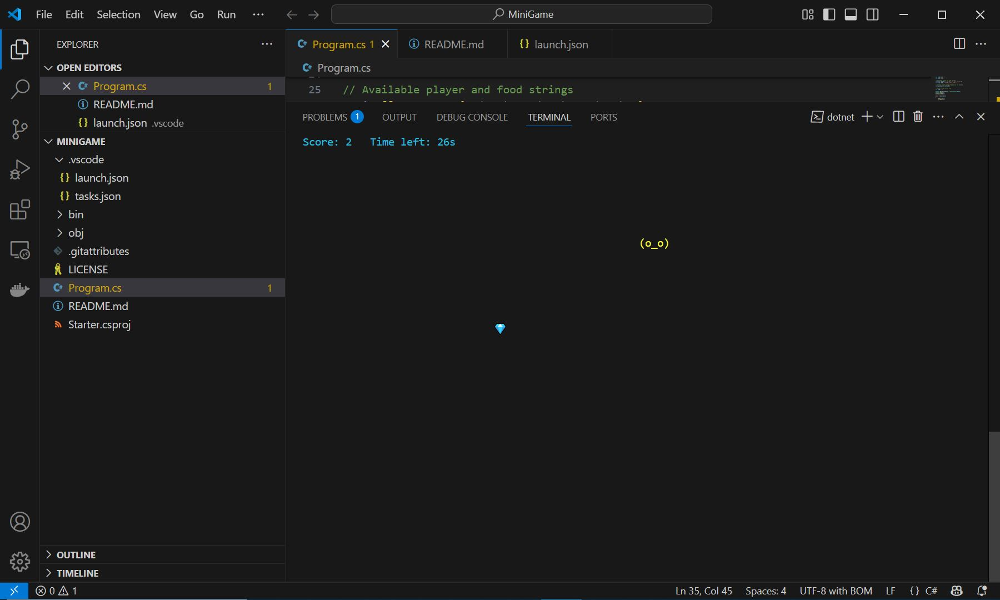

   ____                      _         ____                       
  / ___|___  _ __ ___  _ __ | | ___   / ___| ___  ___ _   _ _ __  
 | |   / _ \| '_ ` _ \| '_ \| |/ _ \ | |  _ / _ \/ __| | | | '_ \ 
 | |__| (_) | | | | | | |_) | |  __/ | |_| |  __/\__ \ |_| | | | |
  \____\___/|_| |_| |_| .__/|_|\___|  \____|\___||___/\__,_|_| |_|
                      |_|                                        

A minimalist real-time snake-inspired console game written in C#, where the player moves to collect different types of food while the clock ticks. Simple controls, real-time updates, and power-up logic make it more than just a basic project.

🎮 Features
Move with arrow keys to collect food.

Three types of food:

💣 Bomb: -10 seconds

🍕 Pizza: +5 seconds

💎 Gem: +15 seconds + speed boost

Color-coded player states.

Time-based gameplay with a live countdown.

Scoreboard display with dynamic updates.

Console window resize detection (auto exit on resize).

Clean UI with non-blocking keyboard input.

🧠 How It Works
The player is rendered with a unique character (e.g., (^_^)).

Food spawns at a random location on the screen.

The timer counts down continuously.

The game ends if time runs out or the player exits manually.

⌨️ Controls
Key	Action
⬆️ / ⬇️ / ⬅️ / ➡️	Move Player
ESC	Quit Game

🧪 Requirements
.NET 6+ SDK

Windows Terminal / Command Prompt that supports emoji (optional)

▶️ How to Run
bash
Copy code
dotnet run
Or compile and run the .exe from your terminal.

📸 Screenshot

📁 Project Structure
cpp

/ConsoleSnakeGame
│
├── Program.cs       // Main game logic
└── README.md        // You're reading it!

🧑‍💻 Author
Micheal Sokoya (a.k.a. Miley)
[GitHub](https://github.com/MileyDev) • [LinkedIn](https://www.linkedin.com/in/micheal-sokoya-4a3307364?utm_source=share&utm_campaign=share_via&utm_content=profile&utm_medium=ios_app)